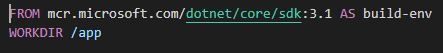
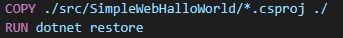
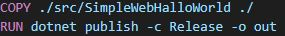
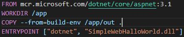
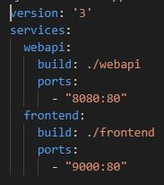

### Blog-b05 - 2020-09-07

###### Ted Henriksson & Aron Cederlund

### Container

##### Vad är en container?

En container är en mjukvarubehållare som är självständig och innehåller alla verktyg för att kunna köra en applikation, så som en lättviktsvariant av ett OS och alla ramverk som behövs för applikationen. En container är mest lämpad till att köra microservices under kortare perioder, till exempel upprätthålla en anslutning mellan ett API och en databas.

##### Docker Desktop

Inför denna lektion så installerade vi verktyget Docker Desktop, som är ett verktyg för att skapa och köra container-images.

Vid övningen där vi skulle köra en simplare webbappikation i en container så klonade vi först ned SimpleWebHalloWorld projektet  och la det i våran Docker-projektmapp. Därefter var vi först tvungna att köra en publish på HalloWorld projektet för att kunna deploya applikationen.

Därefter skapade vi en Dockfilen som ser ut på följande sätt: 

 

Denna kodrad hämtar en image för att skapa en utvecklingsmiljö i .NET.


 

Denna kodrad kopierar hela vårt HelloWorld-projekt och lägger det i en image, som ska senare köras som en container. Sedan kör vi en dotnet restore för att återställa alla dependencies för projektet.


 

Sedan kör vi en dotnet publish på vårt HelloWorld-projekt, detta gör att vi får ut en dll fil på projektet som senare ska köras som en webbapplikation i containern när vi startar den.

  

Detta är det sista steget i dockerfilen, man kan säga att här är själva slutskedet på skapandet av containern. Här går vi från utvecklingsmiljö till produktionsmiljö, det vill säga att vi skapar den färdiga image för att deploya containern.


Sedan bygger vi själva containern med att mata in följande kommando i terminalen

```
docker build -t myapp .
```

Och sedan bestämmer vi på vilken port container ska köras på genom detta kommando:

docker run -d -p 8080:80 --name Helloworld helloworld

För att säkerhetsställla att containern körs matar man in följande kommando

docker ps

Genom att mata kommando docker ps får man en överblick på vilka containrar som körs för tillfälligt, samt vilka id dessa har vilket är användbart om man ska ta bort en container. 

#### Docker Compose

##### Vad är Docker Compose?

Docker Compose är ett ramverk som göra det möjligt att köra flera containers samtidigt i en form av symbios, detta görs genom att man skapar en YAML fil och där matar man in kommandon som konfigurerar applikationernas inställningar på hur de ska köras.

##### Vad innehåller er Docker Compose?

  

Bilden ovan visar på hur vår YAML-fil är uppbyggd. **Version**, som är överst i blocket, talar om vilken filversion av Docker Compose vi använder. Sedan anger vi vilka containerar vi ska använda oss utav under **services** i vardera block. Genom **build** anger vi vilken dockerfil respektive container ska byggas utifrån, samt tilldelar vi portar till respektive container genom raden **ports**.

### Azure Container Instance

##### Hur fick vi upp containern?

Vi började med att logga in på azure i powershell, för att sedan skapa en resource-group för containern.

 

Nästa steg är att skapa containern med resource-group:en vi precis skapat utifrån en image som ligger i **Azure Container Registry**.


Det som sker är att en container skapas och vi tilldelar den en **resource-group**, sedan lägger vi till url utifrån **Azure Container Registry**, därefter sätter vi en tag på containern, vilket kommer bli namnet vi når den. Genom att sätta ports så talar vi på vilken port vi kommunicerar till containern. Utöver dessa kommandon krävs också att vi lägger till username och password för våran **Azure Container Registry** vid skapandet av **Azure Container Instance**.


