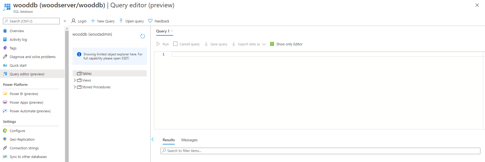

#### Sätta upp en SQL Databas i Azure via CLI

För att sätta upp en SQL Databas i Azure behöver vi börja med att skapa en resource-group för servern och bestämma i vilken region den ska finnas.

 

Nästa steg är att skapa en server för databasen att bli hostad på, likt en container för sin mjukvara. En SQL server kan ha flera databaser kopplade till sig.

 

Vi är även tvugna att lägga till ett undantag i brandväggen hos sql-servern för att kunna ansluta till servern, då den per default inte tillåter någon anslutning alls, det görs genom att lägga till våran ipadress. I vårat fall använder vi oss av samma start och end ipadress, då vi bara har har en fast ipadress, ip-range är mer tänkt för nätverk med statiska ipadresser. 

 

Sista steget är att skapa våran databas på våran sql-server, då vi tilldelar ett namn, configuration där vi väljer GeneralPurpose, som är den billigare varianten med 500-20,0000 **IOPS** (Input/Output Operations Per Second), serverless som innebär att vi betalar för tiden databasen är uppe och även en auto-pause-delay på 120 minuter, då minsta möjliga auto-pause delay är 1 timme.

 

För att kolla att allt gick vägen kan man gå in i Azure Portalen och leta upp sin databas och logga in i "Query editor". Där går det även att lägga till och ta bort data, tables osv.

##### Produktion och utveckling

Det kan vara värt mycket att välja att sätta upp databaser som bara är tänkt att arbeta under utveckling och inte påverka de databaserna som är ute i produktion. För att minimera risken för att något går sönder och minska trafiken till produktionsdatabasen. Viktigt att tänka på är att utvecklingsdatabasen bör efterlikna produktionsdatabasen så mycket som möjligt för att kunna simulera olika scenarior i sina tester som använder så riktig data som möjligt.