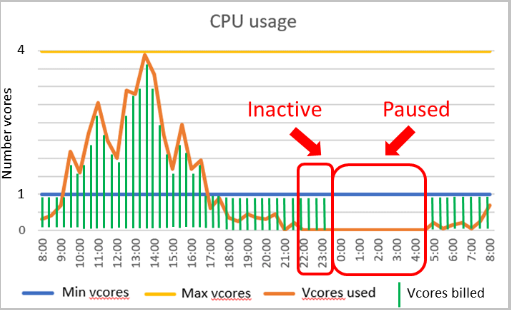
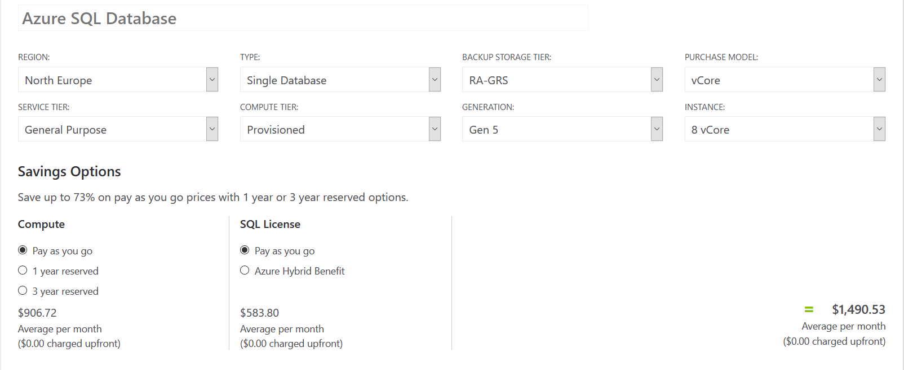

#### **Databaser i molnet**

**Skillnad mellan serverless och provisioned compute**

Den stora skillnaden mellan serverless och provisioned compute är att serverless compute skalar kapaciteten utifrån trafiken och kan även manuellt konfigureras mer enklare än med provisioned compute. Provisioned compute är mer likt en traditionell server med fast hårdvara.

Prissättningen är också en skillnad om man ska köra en databas i molnet. Med en serverless compute betalar man för den tiden som själva servern är aktiv, priset varierar beroende på den kapacitet man vill använda till servern men också hur länge den ska vara igång. Detta gäller inte helt och hållet om man väljer att använda en provisioned compute då den är igång på heltid och man betalar ett fast pris oberoende av aktivitet på servern, även fast ingen använder själva server så blir inte servern pausad som med en serverless uppsättning. Men priset varierar beroende på den prestandan man har valt att databasen ska köras på.


 

Ovan ser vi ett exempelflöde på en databas som är hostad med serverless compute i Azures molntjänst. Den blåa linjen visar den minimala kapaciteten och den gula linjen är den maximala kapaciteten på servern som man betalar för. Den orangea linjen visar aktiviteten på server och de gröna linjerna visar vad man betalar för. Som det syns på bilden så kommer man alltid att betala för den minimala kapaciteten som har angetts, trots att aktiviteten kräver mindre kapacitet.

På exempelflödet kan vi även se den automatiserade skalningen av serverns kapacitet på den orangelinjen, beroende på hur stor aktivitet det är på servern så anpassar skalningen efter de inställningar man har angett och därefter blir prisnivåerna annorlunda.

Vid "Inactive-boxen" som sträcker sig mellan klockan 22:00-23:00 ser vi att man betalar även fast det inte är någon aktivitet på själva servern. Detta beror på att man kan ställa in hur länge servern ska vara igång vid varje aktivitet, detta är till för att få ett smidigt flöde på servern så den inte öppnas och stängs vid varje aktivitet. Om det är en fortsatt inaktivitet på servern efter den inställda tiden stängs servern och man betalar inte för den tiden som servern inte används som vi kan se i "Paused-boxen".

**Prisskillnader på olika databastjänster i molnet**

Här nedan jämförs prisskillnader mellan att sätta upp en databas med hjälp av serverless och provisioned compute, båda kommer att ha samma prestanda och servern kommer att finnas i samma region.

**Provisioned**

 

Här är ett prisexempel på vad skulle kunna kosta att använda sig utav en Azure SQL-databas som körs med en provsioned compute, priset anses för utan bindningstid och utan en SQL-licens. Beroende på syftet med tjänsten kan man sätta upp ett eller tre årsbindningstid för att få ner priset och om man redan har en SQL-licens under Azure Hybrid Benefit avtalet kan man också få ned priset.

**Serverless**

 

Ovan är ett prisexempel på Azure SQL-databas som använder sig utav serverless compute. Här ställer man in minimum samt maximum prestandan på servern, detta har såklart en inverkan på priset, ju högre prestanda desto dyrare blir det. Duration är inställningen på hur länge servern ska vara igång efter senast aktivitet.

**MariaDB**

 

Om man väljer en MariaDB-lösning kommer man att betala per timme som servern ska vara aktiv och hur många servrar man vill ha. Samma som med en provisioned SQL-databas så kan man välja att köra med eller utan bindningstid som kommer att påverka priset.

**Övergripande faktorer som påverkar priset**

Beroende på vart man väljer att sätta upp sin server kan ha en stor påverkan för priset, som exempelvis med en databas som körs med provisoned compute kan det skilja upptill 200 dollar per månad.

Backupkostnaden är mer eller mindre samma för både serverless och provisioned compute, den är uppdelad i två olika segment. Den ena är storleken på backupen och den andra är hur länge man vill förvara backupen, priset baseras på storleken per gigabyte. 


#### Sätta upp en SQL Databas i Azure via CLI

För att sätta upp en SQL Databas i Azure behöver vi börja med att skapa en resource-group för servern och bestämma i vilken region den ska finnas.

```bash
az group create --resource-group datagroup --location northeurope
```

Nästa steg är att skapa en server för databasen att bli hostad på, likt en container för sin mjukvara. En SQL-server kan ha flera databaser kopplade till sig.

```bash
az sql server create --name woodserver --resource-group datagroup --location northeurope --admin-user woodadmin --admin-password ***** 
```

Vi är även tvugna att lägga till ett undantag i brandväggen hos SQL-servern för att kunna ansluta till servern, då den per default inte tillåter någon anslutning alls, det görs genom att lägga till våran ip-adress. I vårat fall använder vi oss av samma start och end ip-adress, då vi bara har har en fast ip-adress, **ip-range** är mer tänkt för nätverk med statiska ip-adresser. 

```bash
az sql server firewall-rule create --resourcegroup datagroup --server woodserver -n AllowYourIp --start-ip-address startIP --end-ip-address endIP 
```

Sista steget är att skapa våran databas på våran sql-server, då vi tilldelar ett **name**, **configuration** där vi väljer GeneralPurpose, som är den billigare varianten med 500-20,0000 **IOPS** (Input/Output Operations Per Second), serverless som innebär att vi betalar för tiden databasen är uppe och även en **auto-pause-delay** på 120 minuter, då minsta möjliga auto-pause delay är 1 timme.

```bash
az sql db create -g datagroup -s woodserver -n wooddb -e GeneralPurpose -f Gen5 -c 2 --compute-model Serverless --auto-pause-delay 120
```

För att kolla att allt gick vägen kan man gå in i Azure Portalen och leta upp sin databas och logga in i "**Query editor**". Där går det även att lägga till och ta bort data, tables osv.


##### Produktion och utveckling

Det kan vara värt mycket att välja att sätta upp databaser som bara är tänkt att arbeta under utveckling och inte påverka de databaserna som är ute i produktion. För att minimera risken för att något går sönder och minska trafiken till produktionsdatabasen. Viktigt att tänka på är att utvecklingsdatabasen bör efterlikna produktionsdatabasen så mycket som möjligt för att kunna simulera olika scenarior i sina tester som använder så riktig data som möjligt.
