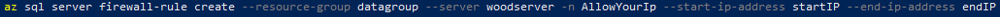

Blog-b05 - Lektion 4: 09-09-2020

#### Sätta upp en SQL Databas i Azure via CLI

Vi börjar med att skapa en resource-group för servern och bestämmer i vilken region den ska finnas.

 

Nästa steg är att skapa en server för databasen att bli hostad på, likt en container för sin mjukvara. En SQL server kan ha flera databaser kopplade till sig.

 

Vi är även tvugna att öppna upp i brandväggen hos sql-servern för att kunna ansluta till denna, det gör genom lägg till våran ipadress som ett undantag. I vårat fall använder vi oss av samma start och end ipadress, då vi bara har har en fast ipadress, ip-range är mer tänkt för lokala nätverk eller nätverk med statiska ipadresser. 

 

Sista steget är att skapa våran databas på våran sql-server, då vi tilldelar ett namn, configuration där vi väljer GeneralPurpose, som är den billigare varianten med 500-20,0000 **IOPS** (Input/Output Operations Per Second), serverless som innebär att vi betalar för tiden databasen är uppe och även en auto-pause-delay på 120 minuter, då minsta möjliga auto-pause delay är 1 timme.

 

