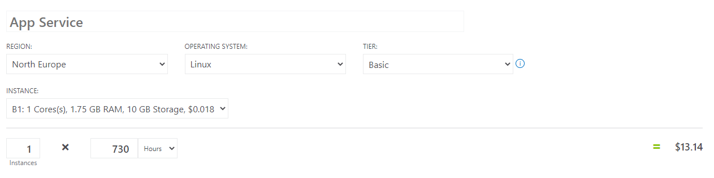
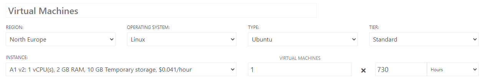
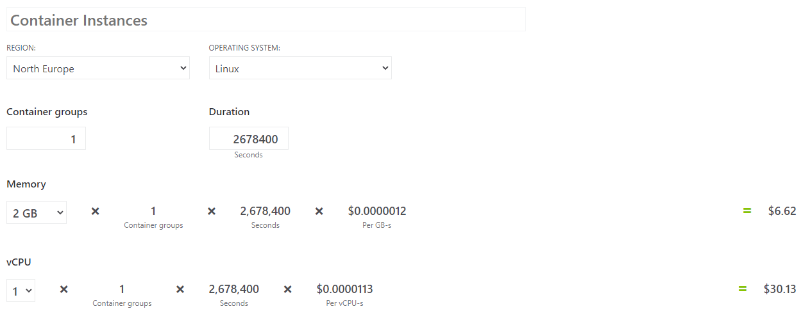
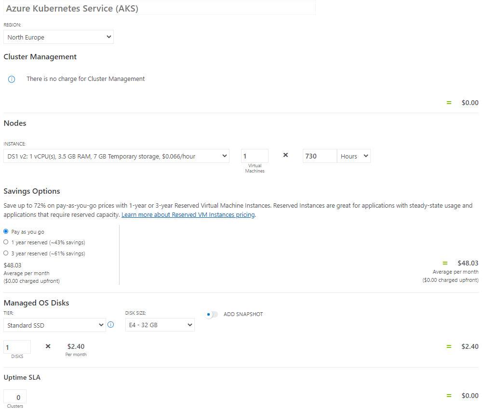

### Priser för en Website i Azure

##### App Service

För att hosta en webbsida i **App Service** kostar det runt 13.14 dollar för en månad för en instans. Då har vi valt att hosta den i North Europe med Linux och 1.75 GB ram och Storage för 0.018 dollar per timme.

##### Virtual Machine

Att hosta en webbsida i en **Virtual Machine** kostar det runt 29.93 dollar per månad, likt App Servicen valde vi att hosta den i North Europe med ett Linux system, men med  2 GB ram och 10 GB storage för 0.041 dollar per timme.

##### Container Instance

Med en **Container Instance** kostar det runt 36.75 dollar per månad i North Europe, med Linux och 2 GB ram som debiteras i GB/sec där priset är 0.0000012 dollar och med CPU/sec där priset är 0.0000113 dollar.

##### Kubernetes Service

Att hosta en Webbsida i **Kubernetes** utifrån 1 Virtual Machine, 3.5 GB Ram och 7 GB storage kostar 0.066 dollar per timme samt med en Standard SSD på 32 GB som kostar 2.4 dollar mer månad. Totalpriset blir 50.43 dollar per månad.