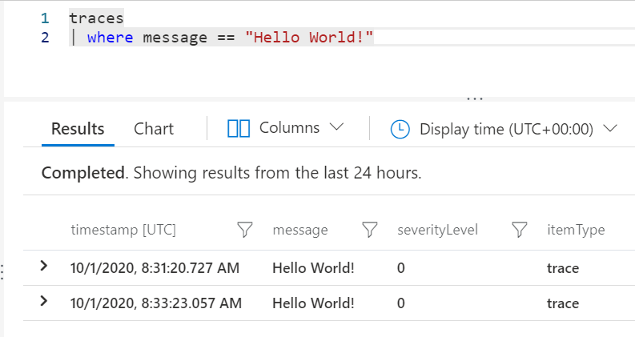
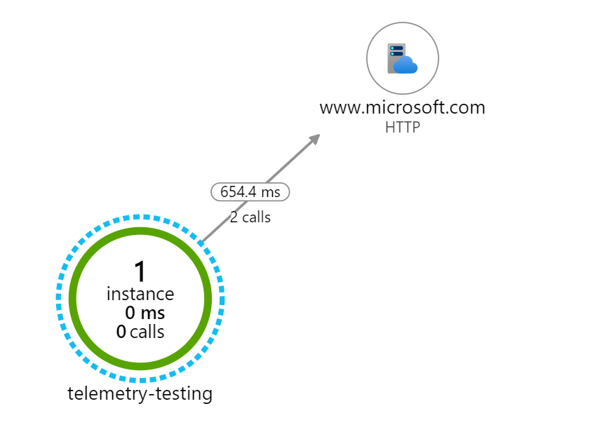

# Loggning med Azure Insights

För att få till loggningen i en *Console Application* var vi tvungna att lägga in loggningen med hjälp av *Dependecy Injection*, vilket innebär att vi måste hantera den som en service. Det hanteras på följande sätt utifrån *ConfigureServices* metoden.

````c#
private static void ConfigureServices(IServiceCollection services)
        {
            services.AddLogging(configure => configure.AddConsole())
                    .AddTransient<Program>();

            IServiceProvider serviceProvider = services.BuildServiceProvider();

            ILogger<Program> logger = serviceProvider.GetRequiredService<ILogger<Program>>();

            using (logger.BeginScope(new Dictionary<string, object> { { "Method", nameof(Main) } }))
            {
                logger.LogInformation("Logger is working");
            }
            
        }
````

Det vi åstadkommer med detta är att vi gör det möjligt att logga till konsolen.

````C#
TelemetryConfiguration configuration = TelemetryConfiguration.CreateDefault();

            configuration.InstrumentationKey = "key";
            configuration.TelemetryInitializers.Add(new HttpDependenciesParsingTelemetryInitializer());
````

För att kunna logga till *Azure Insights* behöver vi lägga till en *TelemetryConfiguration* där vi anger vart den ska logga, till vilken *Azure Insights*, genom att tilldela en *InstrumentationKey* till konfigurationen, för att sedan lägga till vad den ska logga utefter och i vårat fall väljer vi att logga *HTTP-Requests* .

````C#
 var telemetryClient = new TelemetryClient(configuration);
            using (InitializeDependencyTracking(configuration))
            {

                telemetryClient.TrackTrace("Hello World!");
                using (var httpClient = new HttpClient())
                {
                    // Http dependency is automatically tracked!
                    httpClient.GetAsync("https://microsoft.com").Wait();
                }

            }
````

Nästa steg blir att lägga till en *TelemetryClient* som använder sig av konfigurationen som redan är uppsatt, den sköter själva transporten av loggningen från applikationen.

Därefter sätter vi upp och använder *DependencyTracking* för att kunna tracka *HTTP-Requests* under samma scope, som i sin tur loggar mätdatan till *Azure Insights*.

*Tracktrace* kan användas för att namnge ett meddelande för att enklare lokalisera och beskriva mätdatan och för att enklare kunna upptäcka problem så som långsamt anrop mot en databas. Med hjälp av en *query* skulle vi kunna sortera ut alla gånger det uppstått ett långsamt anrop mot en databas och enklare utvärdera anledning till varför.

Nedan visar vi ett exempel på hur en *query* för att hämta ut alla meddelanden som har tilldelats "Hello World!".

 

Med hjälp av *Application Map* kan vi få en tydlig bild hur vårat program uppträder och var det sker hög respektive låg belastning.

Nedan visar vi en bild ifrån *Application Map* uppe i *Azure Insights*, där vi kan vi få mätdata på alla *HTTP-Requests* som vi valt att tracka.

 